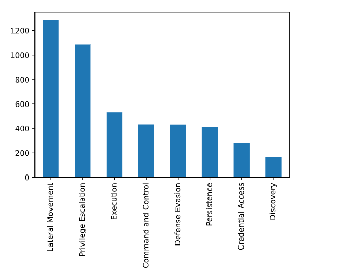

## Description:
The project EVTX-ATTACK-SAMPLES can be used not only to detect and replay attacks but also to provide insight about most relevant telemetry providers and key events that you might consider enabling in your next monitoring data quality assessment. 

## Why ?

- To dynamically process datasets using Jupyter Notebooks.
- To generate advanced analytics and visualisations of EVTX samples using python.
- To provide more insights about telemtry decisiveness over the detection of specific tactics & techniques.

## Examples:

